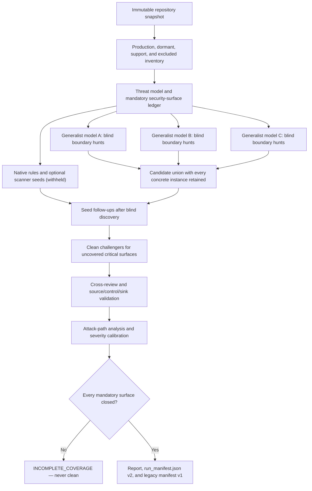

# VulnHunter

> **From pattern-matching to provability.**

VulnHunter is an open-source, **agentic AI security tool** that applies proactive, attacker-first analysis directly to source code. 

> [!NOTE]
> **About this fork:** This repository is **Multi-VulnHunter**, an independent
> fork of [Capital One's original VulnHunter](https://github.com/capitalone/VulnHunter).
> Capital One created the original project and security methodology. This fork
> retains the **VulnHunter** application name, `vulnhunter` CLI command, legacy
> skill names, and Apache 2.0 license; it is not presented as an official
> Capital One release.

## What this fork adds

| Capability | What it provides |
|---|---|
| Multi-model teams | Blind generalist hunts, candidate union, and cross-model review |
| Provider-neutral CLI | Terminal and CI use without requiring Claude Code |
| Broad provider support | Anthropic, OpenAI, OpenRouter, Gemini, Codex CLI, Ollama, and local OpenAI-compatible servers |
| Threat-model workflow | Mandatory surface classification, threat modeling, clean-result challenges, validation, and attack paths |
| Deterministic coverage | Native security rules plus optional Semgrep, Gitleaks, Trivy, and ast-grep seeds |
| Adjustable rigor | Quick, Standard, Deep, and Exhaustive scan levels with explicit closure requirements |
| Safe validation | Static by default; optional target execution occurs only inside the built-in Docker sandbox |
| Operational controls | Cost tracking, rate-limit handling, checkpoints, compatible resume, and typed v2 manifests |
| Coding-tool integration | One root `SKILL.md` for Codex, Claude Code, OpenCode, Pi, and similar tools |

## See it in action

The guided wizard asks for the repository, scan depth, team size, and models.
Its combined catalog shows each active provider, context window, pricing, cache
support, and free-model availability in one numbered list.


Once scanning begins, live progress shows the active assignment, elapsed time,
estimated time remaining, provider usage, completed responses, and tool activity.


## Quick start

### Beginner setup: zero to your first scan

You do not need Docker, Claude Code, Codex, or any optional security scanner for
your first static scan. You need:

- Python 3.12 or newer
- Git
- A model provider: an OpenRouter API key is the simplest remote option, while
  Ollama is available for users who want to keep source code local
- A repository you are authorized to examine

Remote providers receive the repository content needed for their assignments.
VulnHunter shows the exact remote model roster before anything is dispatched.

#### 1. Download and install VulnHunter

Windows PowerShell:

```powershell
git clone https://github.com/JJsilvera1/Multi-VulnHunter.git
cd Multi-VulnHunter

py -3.12 -m venv .venv
.\.venv\Scripts\Activate.ps1
python -m pip install --upgrade pip
python -m pip install -e .\vulnhunter-agent
```

macOS or Linux:

```bash
git clone https://github.com/JJsilvera1/Multi-VulnHunter.git
cd Multi-VulnHunter

python3.12 -m venv .venv
source .venv/bin/activate
python -m pip install --upgrade pip
python -m pip install -e ./vulnhunter-agent
```

The `(.venv)` prefix in the terminal means the environment is active. Activate
it again whenever you open a new terminal before using `vulnhunter`.

#### 2. Add an OpenRouter key

Generate the credential template and open it in a text editor.
If `providers.env` already exists, skip the `env-example` command and open the
existing file so that other saved provider keys are not replaced.

Windows PowerShell:

```powershell
vulnhunter env-example --write "$HOME\.vulnhunter\providers.env"
notepad "$HOME\.vulnhunter\providers.env"
```

macOS or Linux:

```bash
vulnhunter env-example --write ~/.vulnhunter/providers.env
nano ~/.vulnhunter/providers.env
```

Add or update this line, replacing the example with your real key:

```env
OPENROUTER_API_KEY=sk-or-v1-your-key-here
```

Save and close the file. Do not put the key in the target repository, commit it
to Git, paste it into `config.toml`, or share it in screenshots. VulnHunter reads
`~/.vulnhunter/providers.env` automatically and does not copy the secret into
its model configuration.

OpenRouter is optional. Anthropic, OpenAI, Gemini, Codex CLI OAuth, Ollama, and
OpenAI-compatible local servers are documented under
[Provider credentials](#provider-credentials).

There are two different ways to select an OpenAI model:

- With only `OPENROUTER_API_KEY`, choose an `openai/...` model from the
  **OpenRouter** section or type `/openai` in the shared catalog. Usage is routed
  and billed by OpenRouter.
- For the direct **OpenAI API** section, also add
  `OPENAI_API_KEY=your-key` to `providers.env` and rerun `vulnhunter init`.
  Existing configuration is preserved; VulnHunter offers to add the newly
  detected provider without requiring `--force`.

#### 3. Start the guided setup

```powershell
vulnhunter init
```

The wizard will:

1. Detect the OpenRouter key and ask permission to configure the remote
   provider.
2. Ask for the local repository path or Git URL to scan.
3. Ask for an optional branch, tag, or commit.
4. Ask for scan depth and one to three core models.
5. Open the live model catalog. Type a number to select a model, `/text` to
   filter the catalog, `n` for the next page, or `p` for the previous page.
6. Show the selected providers, source-exposure notice, analysis workflow, and
   execution permissions before asking for final confirmation.

For a first experiment, choose **Quick**, **1 model**, and an inexpensive model.
The catalog displays context size and input/output pricing. Free OpenRouter
models can be slower or rate-limited.

Choose **Y** at the final screen to begin, **C** to change the configuration, or
**N** to save the setup without scanning.

#### 4. Read the result correctly

During the scan, the terminal reports the current phase, elapsed time, estimated
time remaining, responses, tool calls, and provider-reported or estimated cost.
At completion it prints paths similar to:

```text
Status:  COMPLETE_FINDINGS
Results: C:\src\my-project_VULNHUNT_RESULTS_multi_...
Report:  C:\src\my-project_VULNHUNT_RESULTS_multi_...\README.md
```

Open the printed report path. The important statuses are:

- `COMPLETE_CLEAN`: completed required coverage without a reportable finding
- `COMPLETE_FINDINGS`: completed coverage and found reportable vulnerabilities
- `COMPLETE_CONDITIONAL`: unresolved or conditional security conclusions; not clean
- `INCOMPLETE_COVERAGE` or `INCOMPLETE_LIMIT`: unfinished; never treat as clean
- `FAILED`: the provider or workflow failed

If an interactive scan is incomplete, accept the resume offer to continue from
its checkpoint instead of repeating completed work.

#### Common beginner problems

`vulnhunter` is not recognized on Windows:

```powershell
cd C:\path\to\Multi-VulnHunter
.\.venv\Scripts\Activate.ps1
vulnhunter --help
```

If PowerShell prevents activation, either allow it for only the current process
or invoke the executable directly:

```powershell
Set-ExecutionPolicy -Scope Process -ExecutionPolicy Bypass
.\.venv\Scripts\Activate.ps1

# Direct alternative:
.\.venv\Scripts\vulnhunter.exe init
```

Provider or credential problems:

```powershell
vulnhunter doctor
```

Docker warnings do not block ordinary static scans. Docker is required only
when the user explicitly supplies `--execute`.

### Import as a skill

For Codex, Claude Code, OpenCode, Pi, or another tool that supports GitHub
Agent Skills, use:

> Install `https://github.com/JJsilvera1/Multi-VulnHunter` as an Agent Skill. Use the
> root `SKILL.md`, then follow the provider setup in the repository README. Do
> not select a remote provider without showing me the source-exposure notice.

The root [`SKILL.md`](SKILL.md) delegates scanning to the same CLI and typed
`run_manifest.json` used by automation.

### Install the CLI

```bash
python -m pip install \
  "git+https://github.com/JJsilvera1/Multi-VulnHunter.git#subdirectory=vulnhunter-agent"

vulnhunter init
```

`vulnhunter init` is the guided first-run command. It detects providers, then
walks through one complete scan setup:

1. Enter an existing local repository path or a Git clone URL.
2. Optionally enter a branch, tag, or commit. Enter scans the current local
   checkout or the remote repository's default branch.
3. Choose Quick, Standard, Deep, or Exhaustive depth.
4. Choose one, two, or three core models.
5. Select each model from the combined live provider catalog.
6. Review source exposure, reasoning settings, and the complete configuration.
7. Review the post-selection workflow, execution permissions, output contract,
   and incomplete-coverage rule.
8. Choose **Y** to continue through preflight and scan, **C** to change the
   setup, or **N** to save without scanning.

The first screen looks like this:

```text
Repository path or Git URL [.]: C:\src\my-project
Git branch, tag, or commit [current/default; Enter keeps default]:

Choose scan level:
  1. Quick        Broad scan, minimal review
  2. Standard     Independent hunts + cross-review
  3. Deep         Gap analysis + additional verification
  4. Exhaustive   Maximum static coverage and evidence

How many core models? [1-3, default 1]: 3

Choose validation mode:
  1. Static/read-only — do not run target code
  2. Docker validation — test suitable findings in the isolated sandbox
Validation mode [1-2, default 1]:
```

After model selection, VulnHunter shows a final review:

```text
Scan configuration
  Repository: C:\src\my-project
  Git ref: current checkout / remote default
  Depth: standard
  Core models: 3
    1. codex-cli/gpt-5.6-sol (REMOTE — source is sent, reasoning high)
    2. openrouter/model-b (REMOTE — source is sent)
    3. ollama/local-coder (local)
  Execution: static/read-only

What happens next
  1. Resolve an immutable repository snapshot and run provider preflight.
  2. Inventory security surfaces and generate a repository threat model.
  3. Run native security rules, then isolated blind model hunts.
  4. Challenge coverage gaps; review, validate, and trace candidates.
  5. Close the coverage ledger and write the report plus manifest v2.
  Optional scanners: used when installed (auto mode); absence is recorded.
  Target code: not executed. Use --execute later for Docker-only validation.
  Result rule: failed or unclosed mandatory coverage is INCOMPLETE_COVERAGE,
  never clean.

Continue to preflight and start if checks pass?
[Y]es / [C]hange / [N] save setup only:
```

The **Change** menu can revise the target/ref, depth, model roster and reasoning
settings, or validation mode. If Docker validation is selected, the review
screen says so explicitly. VulnHunter checks Docker Desktop before it prepares
the repository or contacts a model. When Desktop is installed but stopped, the
walkthrough offers to start it and waits for the engine; it does not interpret a
stopped daemon as a failed security scan.

After **Y**, VulnHunter first resolves the selected revision, creates a stable
snapshot, checks provider health and capabilities, inventories the repository,
and prints its workload, time, and cost forecast. It then runs the selected
depth without another ordinary wizard question. `Ctrl-C`, duration, token, and
cost limits still stop new work safely and preserve a resumable checkpoint.

Native deterministic rules run at every level. Optional tools such as Semgrep,
Gitleaks, Trivy, and ast-grep run when installed under the default
`--static-tools auto` policy; their absence is recorded but does not by itself
make a scan incomplete. Use `--static-tools required` when their availability
must be enforced before any model dispatch.

The default remains static and read-only. `--execute` is never inferred from a
model choice: it must be selected in the guided validation-mode screen or
supplied explicitly and requires the Docker sandbox.
The completed results directory contains the human report, `run_manifest.json`
schema v2, threat model, security-surface and coverage ledgers, deterministic
seeds, and any validation or attack-path artifacts. A failed assignment or
unclosed mandatory surface produces an incomplete status, not a clean result.

Use `vulnhunter init --setup-only` when you only want to configure providers.
After setup, `vulnhunter scan PATH` starts another scan without rebuilding the
provider configuration.

To see every CLI command or detailed help for one command:

```bash
vulnhunter help
vulnhunter help scan
# Standard argparse forms also work:
vulnhunter --help
vulnhunter scan --help
```

The model catalog has provider dividers, pricing, context size, cache
information, and free-model labels. Re-running `init` replaces the saved roster
instead of accumulating additional models.

Useful commands:

| Command | Purpose |
|---|---|
| `vulnhunter models` | Rebuild the one-to-three-model team across all configured providers |
| `vulnhunter doctor` | Check providers, credentials, Git, optional tools, and Docker |
| `vulnhunter sandbox doctor` | Diagnose the Docker validation backend and image |
| `vulnhunter sandbox build` | Build the versioned validation image |
| `vulnhunter init --setup-only` | Configure providers without starting a scan |
| `vulnhunter scan .` | Choose scan depth and a core team of up to three models |
| `vulnhunter scan URL --ref TAG` | Scan an isolated branch, tag, or commit checkout |
| `vulnhunter scan . --execute` | Allow disclosed target commands inside Docker only |
| `vulnhunter scan . --execute --start-docker --yes` | Start Docker Desktop if needed, wait for it, then run unattended |
| `vulnhunter scan . --team-model codex-cli` | Scan with only the saved Codex model |
| `vulnhunter instructions codex` | Print a coding-tool walkthrough |

See the [scanner guide](vulnhunter-agent/README.md) for scan levels, team
behavior, pricing, free-model pacing, live telemetry, budgets, resume, local
runtimes, and automation.

### How multi-model scanning works

VulnHunter now treats “no candidates” and “clean” as different states. It first
creates an immutable repository snapshot, classifies trust boundaries, and
persists a threat model and mandatory security-surface ledger. Core models then
hunt independently without seeing deterministic scanner seeds or one another’s
conclusions. After blind discovery, seeds and uncovered critical surfaces get
focused follow-ups. Candidates are unioned—never majority-voted away—then
reviewed, validated, and assigned an attack path and severity.



Scan level controls rigor; model count controls diversity:

| Level | Additional guarantees |
|---|---|
| Quick | One threat-model pass, native seeds, boundary hunts, semantic candidate reconciliation, fresh-context validation, attack-path analysis, and critical-surface challengers |
| Standard | Quick plus independent hunts from every core model, ring review, one root-cause sweep, and complete mandatory-surface closure |
| Deep | Standard plus a second threat-model review, gap assignments, second review of unique/severe/disputed candidates, and optional Docker reproduction |
| Exhaustive | Deep plus every non-origin review, two sweeps, focused disagreement resolution, and a PoC or explicit proof gap for every surviving instance |

Final candidate dispositions are `REPORTABLE`, `DEFERRED`, `SUPPRESSED`,
`NOT_APPLICABLE`, or `UNRESOLVED`. `DEFERRED`, failed assignments, and unclosed
mandatory surfaces are never presented as a clean scan.

Before downstream review, VulnHunter semantically consolidates paraphrases of
the same root cause. Concrete affected files, lines, entrypoints, traces, and
discoverer provenance remain attached as separate instances. This prevents
three models—or several boundary passes by one model—from triggering a complete
review/validation/attack-path cycle for every differently worded description of
the same defect.

Independent assignments within each phase run concurrently up to
`--max-workers`: boundary hunts run together, followed by concurrent seed
reviews, candidate reviews, validations, and attack-path analyses. The phase
barriers are deliberate. Seeds remain hidden until blind discovery finishes,
review waits until the candidate union is consolidated, and attack-path work
waits for validation. Codex CLI remains serialized because parallel `codex
exec` processes can race its shared OAuth refresh state; direct APIs and
healthy local servers can use multiple workers.

Preflight estimates use repository bytes, lines, approximate callable symbols,
security surfaces, shard count, model reasoning effort, and expected downstream
candidate work. During a phase, ETA is recalculated from observed assignment
durations. OpenRouter billed generation cost is authoritative and includes
provider-side cache discounts; catalog arithmetic is only a fallback. Add
`--verbose --log-file PATH` to record initial system/task prompt estimates,
provider input/output/cache tokens, tool events, and phase progress as JSONL.

### Performance expectations and current comparison status

**Quick is the lowest VulnHunter depth, but it is not a lightweight grep.** It
still inventories security boundaries, creates a threat model, performs blind
model hunts, challenges critical coverage, validates surviving candidates, and
calibrates attack paths. Repository size, model latency, number of consolidated
root causes, and provider concurrency therefore matter more than the word
“Quick.”

A July 2026 development comparison scanned CharismAI revision
`6d1013d522621f72fcb3f490429e891177e52d02` using one Codex CLI
`gpt-5.6-sol` model at medium reasoning, Quick depth, and static/read-only
permissions. Against nine supplied Codex Security reportable instances:

- VulnHunter discovered a counterpart for all nine.
- Eight were finalized as reportable.
- The prospect-details RPC candidate was deferred because the immutable
  snapshot did not contain the deployed SQL authorization definition. Codex
  Security used a definition from an older Git revision; VulnHunter did not
  treat historical code as proof of the current deployed control.
- No assignment remained failed and all mandatory surfaces closed.

That development run took about 4.5 cumulative hours across interruption and
resume sessions and made 211 successful model assignments. It began with the
legacy candidate grouping, which expanded 63 raw candidates into 63 review
tasks, 62 validations, and 61 attack-path analyses. Applying the current
semantic reconciler to the same saved candidates produces 25 root-cause groups
(16 reportable, 7 deferred, and 2 suppressed) while retaining every concrete
instance. New scans use this grouping before downstream work, but a fresh timed
run is still required to measure the real wall-clock improvement.

These results are encouraging, but they are **not a general Codex-parity
claim**. One repository and one stochastic run cannot establish precision,
recall, or runtime parity. The benchmark harness and three-run acceptance gate
described below remain the standard for any broader claim.

Codex CLI is deliberately serialized because parallel CLI processes have
previously raced its shared OAuth refresh state. Direct API, OpenRouter, and
healthy local providers can use `--max-workers` for safe within-phase
concurrency. Checkpoints persist after each assignment, and transient DNS,
stream-disconnect, timeout, and rate-limit errors receive bounded retries.
Authentication, billing, invalid-request, and exhausted-quota errors fail fast
without repeatedly charging or disabling unrelated providers.

### Static analysis and Docker validation

Every scan level is static and read-only unless you explicitly add `--execute`.
Execution is Docker-only; VulnHunter never runs target commands directly on the
host.

```bash
vulnhunter sandbox doctor
vulnhunter sandbox build
vulnhunter scan . --level deep --models 2 --execute
```

With `--execute`, VulnHunter checks the Docker CLI, daemon, Desktop installation,
and sandbox image before repository preparation or model dispatch. Interactive
use offers to start a stopped Docker Desktop. For non-interactive jobs, either
start Docker beforehand or add `--start-docker`; a missing sandbox image still
requires one explicit `vulnhunter sandbox build`.

The sandbox mounts `/source` read-only, copies it into a disposable `/work`,
runs as a non-root user, drops capabilities, applies CPU/memory/PID/time/output
limits, inherits no credentials, mounts no Docker socket, and disables networking
by default. `--allow-private-network` is a separate, prominent opt-in. On Docker
hosts where internet-only egress cannot be enforced, VulnHunter safely rejects
`--allow-network` without the private-network opt-in instead of silently allowing
access to loopback, RFC1918, link-local, metadata, or host addresses.

Codex CLI and other provider-managed agents never receive direct Docker
authority. During validation they can propose bounded argument-array commands;
the VulnHunter engine runs those commands in its own sandbox, records redacted
command artifacts, and returns the results for a separate final-verdict turn.

Advanced scope and tool controls:

```bash
vulnhunter scan . \
  --include-dormant \
  --static-tools auto \
  --threat-model path/to/threat_model.json
```

`--static-tools required` fails before model dispatch if an optional scanner is
missing or cannot run. Scanner matches are seeds, not automatic vulnerabilities.
A reused threat model must match the immutable repository snapshot digest.

### Artifacts and automation contract

`run_manifest.json` is schema version `2`. It records the snapshot digest, phase
and prompt state, surface closure, provider/model provenance, token/cache/cost
usage, sandbox policy, unfinished work, and exact incomplete reasons. Related
artifacts include:

- `threat_model.json` and `threat_model.md`
- `security_surfaces.jsonl` and `coverage_ledger.jsonl`
- `static_seeds.jsonl`
- `validation/<candidate>.json`
- `attack_paths/<candidate>.json`
- `validation_artifacts/` command logs and reproduction output
- the human `README.md`

The legacy `scan_manifest.json` v1 is still emitted for the fixer, verifier, and
publishers. It contains only `REPORTABLE` findings. Conditional, unresolved,
failed, or incomplete v2 runs map to the legacy failure state, so older consumers
cannot mistake partial coverage for clean.

The reproducible comparison harness in
[`vulnhunter-agent/benchmarks/`](vulnhunter-agent/benchmarks/) materializes 25
application fixtures with 100 labeled reportable, deferred, and safe instances.
It scores normalized VulnHunter and Codex Security runs for recall, precision,
High/Critical false-cleans, review survival, coverage closure, cost, tokens, and
duration. The project does not claim Codex parity until the documented
three-run acceptance gate is actually met.

### Provider credentials

VulnHunter references credentials from the process environment or
`~/.vulnhunter/providers.env`; it does not store API keys in its TOML config or
load a target repository's `.env` file.

```bash
mkdir -p ~/.vulnhunter
vulnhunter env-example --write ~/.vulnhunter/providers.env
vulnhunter init
```

Recognized API variables are `OPENROUTER_API_KEY`, `ANTHROPIC_API_KEY`,
`OPENAI_API_KEY`, and `GEMINI_API_KEY`. Ollama and unauthenticated local servers
need no key. An authenticated Codex CLI can also be used without exposing its
OAuth token to VulnHunter; run `codex login`, then `vulnhunter init`.

VulnHunter verifies the selected Codex model with a tiny isolated request before
starting repository hunts and runs Codex assignments one at a time to avoid
OAuth refresh races. If the active CLI is outdated, update it first (npm users:
`npm install -g @openai/codex@latest`), verify with `codex --version`, and run
`codex login` again.

Remote models receive selected repository content. The exact provider roster
and locality are shown before dispatch.

Unlike traditional, passive SAST scanners that flag suspicious patterns and often cause false positives, VulnHunter reasons like an adversary. It **identifies** which defects are actually exploitable, maps prospective attack paths, and proposes targeted, evidence-backed fixes.

Modern software supply chains are deeply interconnected. A single vulnerability in a widely-used open-source component can ripple across thousands of enterprises simultaneously.

Developed internally at Capital One, VulnHunter is released to the community because no single organization can solve this challenge alone.

----

> [!WARNING]
> **Cyber-safeguard disclaimer**
> VulnHunter performs dual-use cybersecurity work (vulnerability discovery and exploitation). If you run it against an Anthropic account that is **not** enrolled in Anthropic's [Cyber Verification Program](https://support.claude.com/en/articles/14604842-real-time-cyber-safeguards-on-claude), real-time cyber safeguards may block requests and your usage may be flagged for cyber abuse. If you intend to use VulnHunter on Anthropic's first-party platforms (Claude API / Claude Code), we strongly recommend enrolling first via the [verification portal](https://portal.anthropic.com/programs/cvp).

---

> [!IMPORTANT]
> **Prerequisites & Model Requirements**
> The legacy prompt-only workflow was optimized for **Claude Opus** in
> **[Claude Code](https://docs.claude.com/en/docs/claude-code)**. The standalone
> scanner is provider-neutral, but security-review quality still depends heavily
> on the selected models. **You supply your own model access.**

---

## Why VulnHunter is Different

* **Attacker-First Forward Analysis:** Conventional tools often leverage "sink-first" analysis, looking at potentially dangerous code patterns to search backward for a hypothetical attacker, flooding teams with false positives. VulnHunter flips this model to simulate a bad actor's exact journey. It begins at potential attacker-accessible entry points (APIs, network messages, file uploads) and reasons *forward* to evaluate whether an attacker can truly break through.
* **Falsification Engine:** After finding a potential vulnerability, VulnHunter runs a structured reasoning workflow specifically designed to *disprove* its own argument. It searches for flawed assumptions, logic gaps, or security controls that would block the attack. It is designed to immediately discard findings that rely on unsupported assumptions. What reaches you is a high-priority, actionable defect.
* **Evidence-Backed Remediation:** When a defect survives the falsification engine, VulnHunter maps the exact exploit path, explains the structural flaw, details the specific capabilities or access an attacker would gain, and generates focused, targeted code changes for review.

---

## The Closed Loop: Hunt → Fix → Verify

VulnHunter ships as three composable [Claude Code](https://docs.claude.com/en/docs/claude-code) skills that form a complete, automated remediation loop:

| Skill | Phase | Core Responsibility |
| :--- | :--- | :--- |
| **`/vulnhunt`** | **Hunt** | Maps entry points to dangerous sinks. Filters findings through a multi-stage falsification pipeline (Recon → Parallel Hunt → Adversarial Disprove → Capability Filter). Emits only verified issues with an executable exploit and a proposed fix. |
| **`/vulnhunter-fix`** | **Fix** | Developer-led, test-driven remediation. It writes an exploit demo, creates a failing security test (**RED**), implements the code fix (**GREEN**), verifies the exploit is blocked without regressions, and cuts a reviewable PR. |
| **`/vulnhunt-fix-verify`** | **Verify** | A completely separate, read-only agent that independently validates whether a finding was successfully remediated. It emits a per-finding verdict so fixes are proven, not taken on faith. |

> **Note:** For running this loop unattended at scale, `vulnhunter-agent/` wraps the scanner in a headless runtime, while `harness/` drives it across multiple repositories in batch.

> **On the naming:** the suite is **VulnHunter**, but the core scanner command is `/vulnhunt` (and the verifier `/vulnhunt-fix-verify`) — the shorter form is intentional, not a typo. The `/vulnhunter-fix` remediation skill and the `vulnhunter-agent/` runtime keep the full spelling.

---

## Repository Layout

Each component is organized into a self-contained subtree:

| Path | Description |
| :--- | :--- |
| `SKILL.md` | Universal provider-neutral skill entry point for coding tools that can import Agent Skills. |
| `vulnhunt/` | The core `/vulnhunt` scanner skill (Prompt-only: `SKILL.md` + phases). See [`vulnhunt/README.md`](vulnhunt/README.md). |
| `vulnhunter-fix/` | The `/vulnhunter-fix` skill, its companion Python helper package, and tests. See [`vulnhunter-fix/README.md`](vulnhunter-fix/README.md). |
| `vulnhunt-fix-verify/` | The `/vulnhunt-fix-verify` standalone verification skill (Prompt-only). See [`vulnhunt-fix-verify/README.md`](vulnhunt-fix-verify/README.md). |
| `vulnhunter-agent/` | Config-driven headless runtime wrapper that runs scans and files GitHub issues. See [`vulnhunter-agent/README.md`](vulnhunter-agent/README.md). |
| `harness/` | Developer tooling for running large batch-scans and benchmarking detection accuracy. See [`harness/README.md`](harness/README.md). |

---

## Requirements & Setup

### Prerequisites
* Python 3.12+ for the provider-neutral CLI.
* Claude Code with Claude Opus only when using the legacy prompt-only workflow.
* *Responsibility Check:* Ensure you are only scanning code bases you are explicitly authorized to analyze.

### Installation

Provider-neutral CLI from GitHub:

```bash
python -m pip install \
  "git+https://github.com/JJsilvera1/Multi-VulnHunter.git#subdirectory=vulnhunter-agent"
vulnhunter init
```

For a local editable checkout on Windows PowerShell:

```powershell
git clone https://github.com/JJsilvera1/Multi-VulnHunter.git
cd Multi-VulnHunter\vulnhunter-agent
py -3.12 -m venv .venv
.\.venv\Scripts\Activate.ps1
python -m pip install -e ".[dev]"
vulnhunter init
vulnhunter doctor
vulnhunter scan .
```

Activate the environment again whenever you open a new PowerShell window:

```powershell
cd Multi-VulnHunter\vulnhunter-agent
.\.venv\Scripts\Activate.ps1
```

If activation is unavailable, invoke the installed command directly with
`.\.venv\Scripts\vulnhunter.exe`. On macOS or Linux, use
`python3.12 -m venv .venv` followed by `source .venv/bin/activate`.

For editable development or the legacy Claude skills:

```bash
# Clone the repository
git clone https://github.com/JJsilvera1/Multi-VulnHunter.git
cd Multi-VulnHunter

# Copy the legacy skills into ~/.claude/skills/
./install.sh      

# (Optional) To clean up or remove installed skills
# ./uninstall.sh    
```

> [!NOTE]
> `install.sh` copies files directly (rather than symlinking) because symlinks can break `find`/`glob` functionality inside subagents. Re-run `./install.sh` after pulling updates to refresh your local environment.

---

## Usage Guide

### 1. Run the Scanner
```bash
claude --model opus --add-dir ~/.claude/skills/vulnhunt --add-dir ~/.claude/skills/vulnhunt/phases

# Inside the Claude Code session, invoke:
/vulnhunt
```

### 2. Run the Fixer
The fixer requires `git`, the GitHub CLI (`gh`) authenticated to your target repositories, and its Python helpers installed (`pip install -e ".[dev]"` inside the `vulnhunter-fix/` directory).

```bash
claude --model opus --add-dir ~/.claude/skills/vulnhunter-fix

# Inside the Claude Code session, invoke:
/vulnhunter-fix
```
*See [`vulnhunter-fix/README.md`](vulnhunter-fix/README.md) for advanced operational modes and configuration settings.*

### 3. Run the Fix Verifier
The verifier runs strictly read-only over trusted roots under a tight tool envelope (Read/Write/Edit/Glob/Grep/Agent—**no Bash execution, no network access**). The caller must pre-create the output (`out`) directory.

```bash
claude --model opus --add-dir ~/.claude/skills/vulnhunt-fix-verify \
       --add-dir ~/.claude/skills/vulnhunt-fix-verify/phases

# Inside the Claude Code session, invoke:
/vulnhunt-fix-verify repo=<abs_path> report=<abs_path> fixed=VULN-001,... out=<abs_path> [comments=<abs_path>] [additional_repos=<path1>,<path2>]
```

---

## Automation & Scale

### Headless Runtime Agent (`vulnhunter-agent/`)
For non-interactive or CI/CD pipelines, `vulnhunter-agent/` provides the
provider-neutral `vulnhunter` CLI as well as the transition-period legacy
Claude workflow. The native CLI emits compatible report and manifest artifacts;
the legacy agent retains its existing publishing and GitHub issue paths.

Review the [`vulnhunter-agent/README.md`](vulnhunter-agent/README.md) for deployment blueprints.

### Local Harness (`harness/`)
The `harness/` directory provides workstation-scale developer tooling. To initialize, run `cd harness && pip install -e ".[dev]"`.

#### Batch Scanning
Manage your target list in `harness/local_harness/batch/REPO_LIST.txt` (one GitHub URL per line, lines starting with `#` are ignored):

```bash
cd harness
python -m local_harness.batch.run scan                  # Clone and scan every repo in the list
python -m local_harness.batch.run scan --resume         # Skip repositories already processed
python -m local_harness.batch.run status                # Monitor progress across your batch
python -m local_harness.batch.run collect               # Gather all findings for centralized review
```

#### Benchmarking Mode
Evaluate scanner accuracy against a known-vulnerable vulnerability corpus (Clone → Scan → LLM-Judge → Tally Metrics):

```bash
python -m local_harness.benchmark.run                  # Execute full benchmark run
python -m local_harness.benchmark.run --repos "name"   # Benchmark a single target repository
python -m local_harness.benchmark.run --tally-only      # Re-generate the analytical report only
```

> **Bring Your Own Corpus:** This repository ships with a minimal synthetic example (`harness/local_harness/benchmark/ground_truth/EXAMPLE.json`) mapped to public targets like OWASP NodeGoat, Juice Shop, and WebGoat. Build out your own testing suites inside `ground_truth/<repo>.json`. Define your target scanning/judging engines in `harness/local_harness/config.py`.

---

## Running Tests

Each Python component maintains its own isolated testing suite. Run them using `pytest`:

```bash
cd harness          && pip install -e ".[dev]" && python -m pytest tests/ --cov=local_harness
cd vulnhunter-fix   && pip install -e ".[dev]" && python -m pytest -q
cd vulnhunter-agent && pip install -e ".[dev]" && python -m pytest -q
```

---

## Contributing, Security & License

* **A Note on Models:** VulnHunter was precision-tuned for **Claude Opus** and **Claude Code**. Its low false-positive discipline relies heavily on frontier-class reasoning, though the underlying orchestration patterns can be adapted to other advanced foundation models.
* **Contributing:** See [CONTRIBUTING.md](CONTRIBUTING.md) to propose core framework improvements, prompt updates, or wider model support configurations.
* **Security:** Review [SECURITY.md](SECURITY.md) for instructions on how to safely report security vulnerabilities found within VulnHunter itself.
* **License:** Distributed under the terms of the Apache License, Version 2.0. See [LICENSE](LICENSE) for details.
