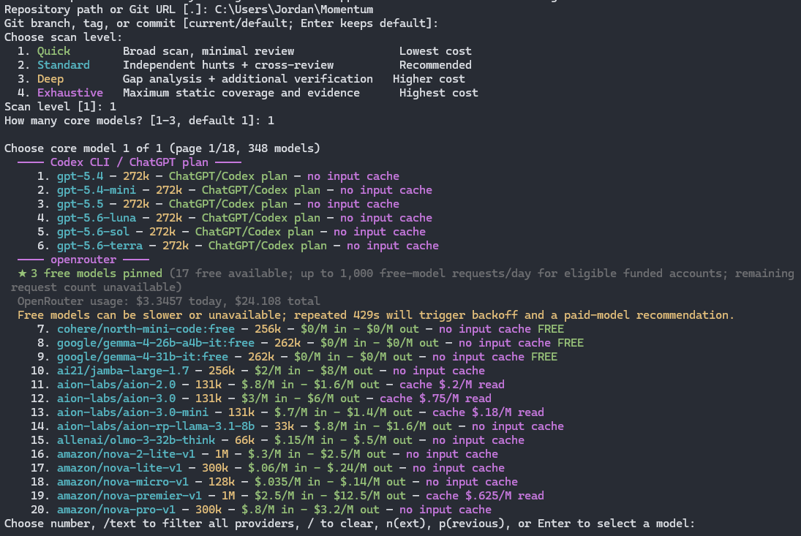
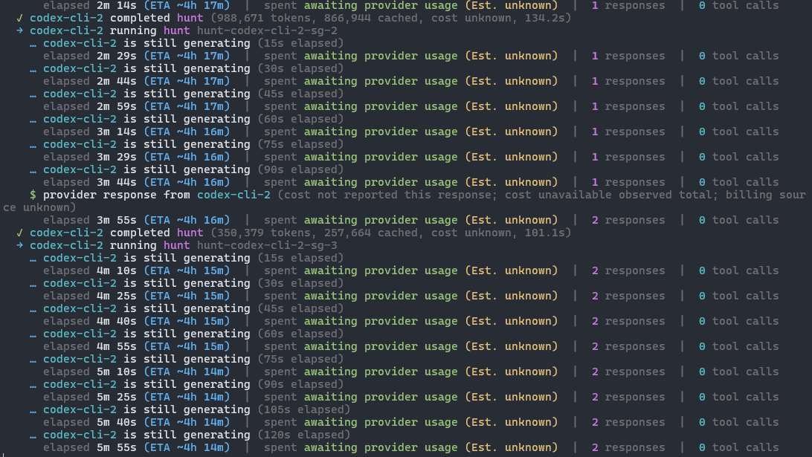
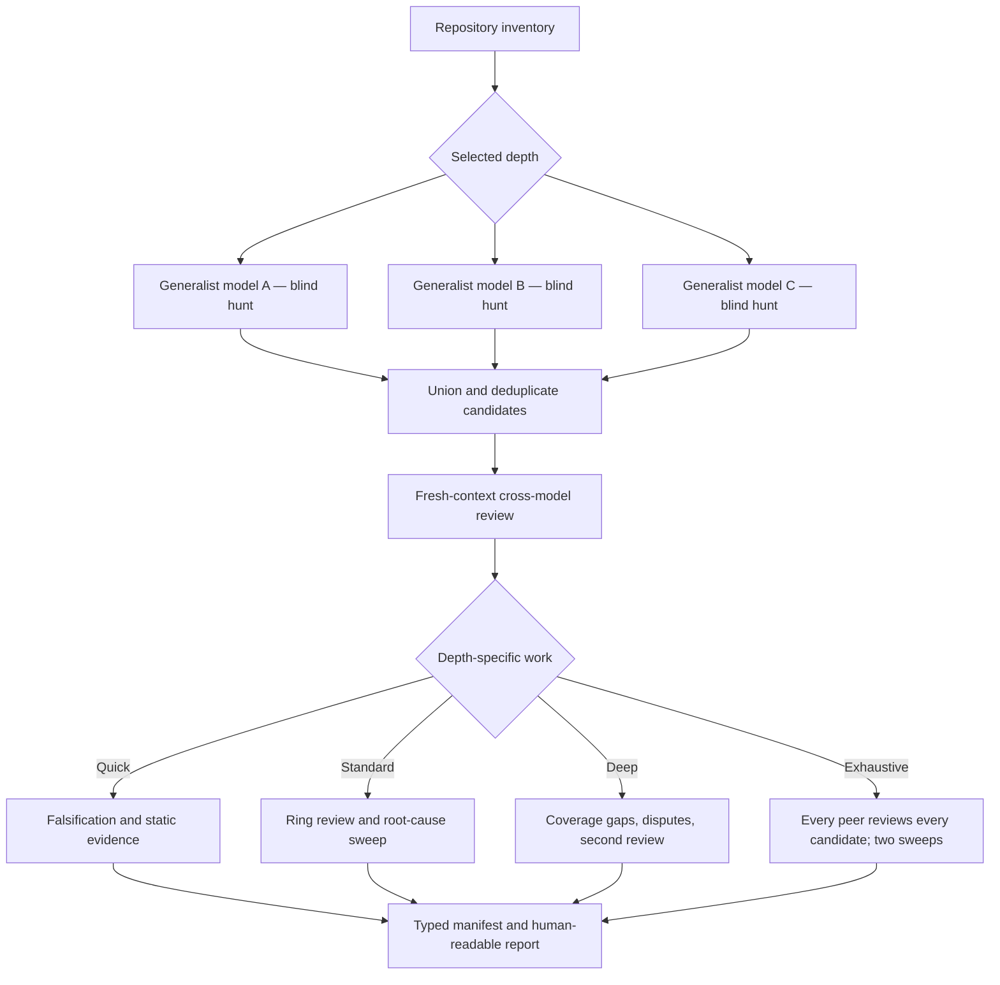

# VulnHunter

> **From pattern-matching to provability.**

VulnHunter is an open-source, **agentic AI security tool** that applies proactive, attacker-first analysis directly to source code. 

> [!NOTE]
> **About this fork:** This repository is **Multi-VulnHunter**, an independent
> fork of [Capital One's original VulnHunter](https://github.com/capitalone/VulnHunter).
> Capital One created the original project and security methodology. This fork
> retains the **VulnHunter** application name, `vulnhunter` CLI command, legacy
> skill names, and Apache 2.0 license; it is not presented as an official
> Capital One release.

## What this fork adds

| Capability | What it provides |
|---|---|
| Multi-model teams | Blind generalist hunts, candidate union, and cross-model review |
| Provider-neutral CLI | Terminal and CI use without requiring Claude Code |
| Broad provider support | Anthropic, OpenAI, OpenRouter, Gemini, Codex CLI, Ollama, and local OpenAI-compatible servers |
| Adjustable rigor | Quick, Standard, Deep, and Exhaustive scan levels |
| Operational controls | Cost tracking, rate-limit handling, checkpoints, resume, and typed manifests |
| Coding-tool integration | One root `SKILL.md` for Codex, Claude Code, OpenCode, Pi, and similar tools |

## See it in action

The guided wizard asks for the repository, scan depth, team size, and models.
Its combined catalog shows each active provider, context window, pricing, cache
support, and free-model availability in one numbered list.



Once scanning begins, live progress shows the active assignment, elapsed time,
estimated time remaining, provider usage, completed responses, and tool activity.



## Quick start

### Import as a skill

For Codex, Claude Code, OpenCode, Pi, or another tool that supports GitHub
Agent Skills, use:

> Install `https://github.com/JJsilvera1/Multi-VulnHunter` as an Agent Skill. Use the
> root `SKILL.md`, then follow the provider setup in the repository README. Do
> not select a remote provider without showing me the source-exposure notice.

The root [`SKILL.md`](SKILL.md) delegates scanning to the same CLI and typed
`run_manifest.json` used by automation.

### Install the CLI

```bash
python -m pip install \
  "git+https://github.com/JJsilvera1/Multi-VulnHunter.git#subdirectory=vulnhunter-agent"

vulnhunter init
```

`vulnhunter init` is the guided first-run command. It detects providers, then
walks through one complete scan setup:

1. Enter an existing local repository path or a Git clone URL.
2. Optionally enter a branch, tag, or commit. Enter scans the current local
   checkout or the remote repository's default branch.
3. Choose Quick, Standard, Deep, or Exhaustive depth.
4. Choose one, two, or three core models.
5. Select each model from the combined live provider catalog.
6. Review source exposure, reasoning settings, and the complete configuration.
7. Choose **Y** to scan, **C** to change it, or **N** to save without scanning.

The first screen looks like this:

```text
Repository path or Git URL [.]: C:\src\my-project
Git branch, tag, or commit [current/default; Enter keeps default]:

Choose scan level:
  1. Quick        Broad scan, minimal review
  2. Standard     Independent hunts + cross-review
  3. Deep         Gap analysis + additional verification
  4. Exhaustive   Maximum static coverage and evidence

How many core models? [1-3, default 1]: 3
```

After model selection, VulnHunter shows a final review:

```text
Scan configuration
  Repository: C:\src\my-project
  Git ref: current checkout / remote default
  Depth: standard
  Core models: 3
    1. codex-cli/gpt-5.6-sol (REMOTE — source is sent, reasoning high)
    2. openrouter/model-b (REMOTE — source is sent)
    3. ollama/local-coder (local)
  Execution: static/read-only

Start this scan? [Y]es / [C]hange / [N] save setup only:
```

Use `vulnhunter init --setup-only` when you only want to configure providers.
After setup, `vulnhunter scan PATH` starts another scan without rebuilding the
provider configuration.

To see every CLI command or detailed help for one command:

```bash
vulnhunter help
vulnhunter help scan
# Standard argparse forms also work:
vulnhunter --help
vulnhunter scan --help
```

The model catalog has provider dividers, pricing, context size, cache
information, and free-model labels. Re-running `init` replaces the saved roster
instead of accumulating additional models.

Useful commands:

| Command | Purpose |
|---|---|
| `vulnhunter models` | Change saved models across active providers |
| `vulnhunter doctor` | Check providers, credentials, Git, and local prerequisites |
| `vulnhunter init --setup-only` | Configure providers without starting a scan |
| `vulnhunter scan .` | Choose scan depth and a core team of up to three models |
| `vulnhunter scan URL --ref TAG` | Scan an isolated branch, tag, or commit checkout |
| `vulnhunter scan . --team-model codex-cli` | Scan with only the saved Codex model |
| `vulnhunter instructions codex` | Print a coding-tool walkthrough |

See the [scanner guide](vulnhunter-agent/README.md) for scan levels, team
behavior, pricing, free-model pacing, live telemetry, budgets, resume, local
runtimes, and automation.

### How multi-model scanning works

Core models begin as unrestricted generalists. They hunt independently and do
not see one another's conclusions until blind discovery finishes. Candidates
are unioned—never majority-voted away—and then reviewed in fresh contexts.
Higher depth settings add coverage analysis, focused follow-ups, more reviewers,
and stronger evidence requirements.



### Provider credentials

VulnHunter references credentials from the process environment or
`~/.vulnhunter/providers.env`; it does not store API keys in its TOML config or
load a target repository's `.env` file.

```bash
mkdir -p ~/.vulnhunter
vulnhunter env-example --write ~/.vulnhunter/providers.env
vulnhunter init
```

Recognized API variables are `OPENROUTER_API_KEY`, `ANTHROPIC_API_KEY`,
`OPENAI_API_KEY`, and `GEMINI_API_KEY`. Ollama and unauthenticated local servers
need no key. An authenticated Codex CLI can also be used without exposing its
OAuth token to VulnHunter; run `codex login`, then `vulnhunter init`.

VulnHunter verifies the selected Codex model with a tiny isolated request before
starting repository hunts and runs Codex assignments one at a time to avoid
OAuth refresh races. If the active CLI is outdated, update it first (npm users:
`npm install -g @openai/codex@latest`), verify with `codex --version`, and run
`codex login` again.

Remote models receive selected repository content. The exact provider roster
and locality are shown before dispatch.

Unlike traditional, passive SAST scanners that flag suspicious patterns and often cause false positives, VulnHunter reasons like an adversary. It **identifies** which defects are actually exploitable, maps prospective attack paths, and proposes targeted, evidence-backed fixes.

Modern software supply chains are deeply interconnected. A single vulnerability in a widely-used open-source component can ripple across thousands of enterprises simultaneously.

Developed internally at Capital One, VulnHunter is released to the community because no single organization can solve this challenge alone.

----

> [!WARNING]
> **Cyber-safeguard disclaimer**
> VulnHunter performs dual-use cybersecurity work (vulnerability discovery and exploitation). If you run it against an Anthropic account that is **not** enrolled in Anthropic's [Cyber Verification Program](https://support.claude.com/en/articles/14604842-real-time-cyber-safeguards-on-claude), real-time cyber safeguards may block requests and your usage may be flagged for cyber abuse. If you intend to use VulnHunter on Anthropic's first-party platforms (Claude API / Claude Code), we strongly recommend enrolling first via the [verification portal](https://portal.anthropic.com/programs/cvp).

---

> [!IMPORTANT]
> **Prerequisites & Model Requirements**
> The legacy prompt-only workflow was optimized for **Claude Opus** in
> **[Claude Code](https://docs.claude.com/en/docs/claude-code)**. The standalone
> scanner is provider-neutral, but security-review quality still depends heavily
> on the selected models. **You supply your own model access.**

---

## Why VulnHunter is Different

* **Attacker-First Forward Analysis:** Conventional tools often leverage "sink-first" analysis, looking at potentially dangerous code patterns to search backward for a hypothetical attacker, flooding teams with false positives. VulnHunter flips this model to simulate a bad actor's exact journey. It begins at potential attacker-accessible entry points (APIs, network messages, file uploads) and reasons *forward* to evaluate whether an attacker can truly break through.
* **Falsification Engine:** After finding a potential vulnerability, VulnHunter runs a structured reasoning workflow specifically designed to *disprove* its own argument. It searches for flawed assumptions, logic gaps, or security controls that would block the attack. It is designed to immediately discard findings that rely on unsupported assumptions. What reaches you is a high-priority, actionable defect.
* **Evidence-Backed Remediation:** When a defect survives the falsification engine, VulnHunter maps the exact exploit path, explains the structural flaw, details the specific capabilities or access an attacker would gain, and generates focused, targeted code changes for review.

---

## The Closed Loop: Hunt → Fix → Verify

VulnHunter ships as three composable [Claude Code](https://docs.claude.com/en/docs/claude-code) skills that form a complete, automated remediation loop:

| Skill | Phase | Core Responsibility |
| :--- | :--- | :--- |
| **`/vulnhunt`** | **Hunt** | Maps entry points to dangerous sinks. Filters findings through a multi-stage falsification pipeline (Recon → Parallel Hunt → Adversarial Disprove → Capability Filter). Emits only verified issues with an executable exploit and a proposed fix. |
| **`/vulnhunter-fix`** | **Fix** | Developer-led, test-driven remediation. It writes an exploit demo, creates a failing security test (**RED**), implements the code fix (**GREEN**), verifies the exploit is blocked without regressions, and cuts a reviewable PR. |
| **`/vulnhunt-fix-verify`** | **Verify** | A completely separate, read-only agent that independently validates whether a finding was successfully remediated. It emits a per-finding verdict so fixes are proven, not taken on faith. |

> **Note:** For running this loop unattended at scale, `vulnhunter-agent/` wraps the scanner in a headless runtime, while `harness/` drives it across multiple repositories in batch.

> **On the naming:** the suite is **VulnHunter**, but the core scanner command is `/vulnhunt` (and the verifier `/vulnhunt-fix-verify`) — the shorter form is intentional, not a typo. The `/vulnhunter-fix` remediation skill and the `vulnhunter-agent/` runtime keep the full spelling.

---

## Repository Layout

Each component is organized into a self-contained subtree:

| Path | Description |
| :--- | :--- |
| `SKILL.md` | Universal provider-neutral skill entry point for coding tools that can import Agent Skills. |
| `vulnhunt/` | The core `/vulnhunt` scanner skill (Prompt-only: `SKILL.md` + phases). See [`vulnhunt/README.md`](vulnhunt/README.md). |
| `vulnhunter-fix/` | The `/vulnhunter-fix` skill, its companion Python helper package, and tests. See [`vulnhunter-fix/README.md`](vulnhunter-fix/README.md). |
| `vulnhunt-fix-verify/` | The `/vulnhunt-fix-verify` standalone verification skill (Prompt-only). See [`vulnhunt-fix-verify/README.md`](vulnhunt-fix-verify/README.md). |
| `vulnhunter-agent/` | Config-driven headless runtime wrapper that runs scans and files GitHub issues. See [`vulnhunter-agent/README.md`](vulnhunter-agent/README.md). |
| `harness/` | Developer tooling for running large batch-scans and benchmarking detection accuracy. See [`harness/README.md`](harness/README.md). |

---

## Requirements & Setup

### Prerequisites
* Python 3.12+ for the provider-neutral CLI.
* Claude Code with Claude Opus only when using the legacy prompt-only workflow.
* *Responsibility Check:* Ensure you are only scanning code bases you are explicitly authorized to analyze.

### Installation

Provider-neutral CLI from GitHub:

```bash
python -m pip install \
  "git+https://github.com/JJsilvera1/Multi-VulnHunter.git#subdirectory=vulnhunter-agent"
vulnhunter init
```

For a local editable checkout on Windows PowerShell:

```powershell
git clone https://github.com/JJsilvera1/Multi-VulnHunter.git
cd Multi-VulnHunter\vulnhunter-agent
py -3.12 -m venv .venv
.\.venv\Scripts\Activate.ps1
python -m pip install -e ".[dev]"
vulnhunter init
vulnhunter doctor
vulnhunter scan .
```

Activate the environment again whenever you open a new PowerShell window:

```powershell
cd Multi-VulnHunter\vulnhunter-agent
.\.venv\Scripts\Activate.ps1
```

If activation is unavailable, invoke the installed command directly with
`.\.venv\Scripts\vulnhunter.exe`. On macOS or Linux, use
`python3.12 -m venv .venv` followed by `source .venv/bin/activate`.

For editable development or the legacy Claude skills:

```bash
# Clone the repository
git clone https://github.com/JJsilvera1/Multi-VulnHunter.git
cd Multi-VulnHunter

# Copy the legacy skills into ~/.claude/skills/
./install.sh      

# (Optional) To clean up or remove installed skills
# ./uninstall.sh    
```

> [!NOTE]
> `install.sh` copies files directly (rather than symlinking) because symlinks can break `find`/`glob` functionality inside subagents. Re-run `./install.sh` after pulling updates to refresh your local environment.

---

## Usage Guide

### 1. Run the Scanner
```bash
claude --model opus --add-dir ~/.claude/skills/vulnhunt --add-dir ~/.claude/skills/vulnhunt/phases

# Inside the Claude Code session, invoke:
/vulnhunt
```

### 2. Run the Fixer
The fixer requires `git`, the GitHub CLI (`gh`) authenticated to your target repositories, and its Python helpers installed (`pip install -e ".[dev]"` inside the `vulnhunter-fix/` directory).

```bash
claude --model opus --add-dir ~/.claude/skills/vulnhunter-fix

# Inside the Claude Code session, invoke:
/vulnhunter-fix
```
*See [`vulnhunter-fix/README.md`](vulnhunter-fix/README.md) for advanced operational modes and configuration settings.*

### 3. Run the Fix Verifier
The verifier runs strictly read-only over trusted roots under a tight tool envelope (Read/Write/Edit/Glob/Grep/Agent—**no Bash execution, no network access**). The caller must pre-create the output (`out`) directory.

```bash
claude --model opus --add-dir ~/.claude/skills/vulnhunt-fix-verify \
       --add-dir ~/.claude/skills/vulnhunt-fix-verify/phases

# Inside the Claude Code session, invoke:
/vulnhunt-fix-verify repo=<abs_path> report=<abs_path> fixed=VULN-001,... out=<abs_path> [comments=<abs_path>] [additional_repos=<path1>,<path2>]
```

---

## Automation & Scale

### Headless Runtime Agent (`vulnhunter-agent/`)
For non-interactive or CI/CD pipelines, `vulnhunter-agent/` provides the
provider-neutral `vulnhunter` CLI as well as the transition-period legacy
Claude workflow. The native CLI emits compatible report and manifest artifacts;
the legacy agent retains its existing publishing and GitHub issue paths.

Review the [`vulnhunter-agent/README.md`](vulnhunter-agent/README.md) for deployment blueprints.

### Local Harness (`harness/`)
The `harness/` directory provides workstation-scale developer tooling. To initialize, run `cd harness && pip install -e ".[dev]"`.

#### Batch Scanning
Manage your target list in `harness/local_harness/batch/REPO_LIST.txt` (one GitHub URL per line, lines starting with `#` are ignored):

```bash
cd harness
python -m local_harness.batch.run scan                  # Clone and scan every repo in the list
python -m local_harness.batch.run scan --resume         # Skip repositories already processed
python -m local_harness.batch.run status                # Monitor progress across your batch
python -m local_harness.batch.run collect               # Gather all findings for centralized review
```

#### Benchmarking Mode
Evaluate scanner accuracy against a known-vulnerable vulnerability corpus (Clone → Scan → LLM-Judge → Tally Metrics):

```bash
python -m local_harness.benchmark.run                  # Execute full benchmark run
python -m local_harness.benchmark.run --repos "name"   # Benchmark a single target repository
python -m local_harness.benchmark.run --tally-only      # Re-generate the analytical report only
```

> **Bring Your Own Corpus:** This repository ships with a minimal synthetic example (`harness/local_harness/benchmark/ground_truth/EXAMPLE.json`) mapped to public targets like OWASP NodeGoat, Juice Shop, and WebGoat. Build out your own testing suites inside `ground_truth/<repo>.json`. Define your target scanning/judging engines in `harness/local_harness/config.py`.

---

## Running Tests

Each Python component maintains its own isolated testing suite. Run them using `pytest`:

```bash
cd harness          && pip install -e ".[dev]" && python -m pytest tests/ --cov=local_harness
cd vulnhunter-fix   && pip install -e ".[dev]" && python -m pytest -q
cd vulnhunter-agent && pip install -e ".[dev]" && python -m pytest -q
```

---

## Contributing, Security & License

* **A Note on Models:** VulnHunter was precision-tuned for **Claude Opus** and **Claude Code**. Its low false-positive discipline relies heavily on frontier-class reasoning, though the underlying orchestration patterns can be adapted to other advanced foundation models.
* **Contributing:** See [CONTRIBUTING.md](CONTRIBUTING.md) to propose core framework improvements, prompt updates, or wider model support configurations.
* **Security:** Review [SECURITY.md](SECURITY.md) for instructions on how to safely report security vulnerabilities found within VulnHunter itself.
* **License:** Distributed under the terms of the Apache License, Version 2.0. See [LICENSE](LICENSE) for details.
